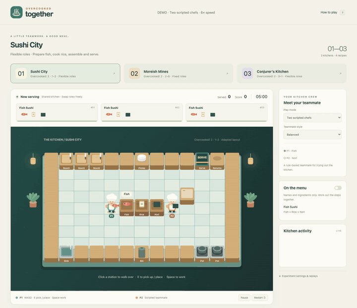

# Overcooked Together

A two-player cooking environment for multi-agent reinforcement learning, inspired by **Overcooked! 2**, with an interactive browser interface. Version 0.1 is a runnable prototype for testing mechanics and connecting policies. The rules are independently implemented and all artwork is original. It includes no commercial game assets and is not a direct fork of Collab-Overcooked.

## Demo



Burger kitchen · Two scripted chefs · 20 seconds at 4× speed

Actual browser gameplay in Moreish Mines, cropped to the kitchen: one chef cooks on the right and passes food through the turntable; the other assembles and serves burgers on the left. The scripted chefs have explicit recipe knowledge; default agent observations omit recipe procedures. This is a mechanics demonstration, not a trained-policy result.

## Open the kitchen

Double-click **Launch.command** on macOS, or run this from the project directory:

```bash
npm start
# Open http://127.0.0.1:8765 in your browser.
```

Requires Node.js 20+. The browser app has no npm dependencies. Choose between a scripted teammate, two local players sharing a keyboard, or a demonstration with two scripted chefs.

- P1: WASD to move or turn, E to pick up, place, combine, or serve, and Space to chop or wash plates.
- P2: arrow keys to move, Enter to pick up or place, and Shift to work. Available in local two-player mode.
- P pauses or resumes. Tab switches the controlled chef in scripted-teammate mode.
- Clicking a station navigates to it and performs one interaction. This browser input helper still executes primitive actions one tick at a time.
- The menu toggle reveals full recipe procedures. By default, only recipe names and ingredients are shown.
- **Experiment settings & replays** exports the current episode as JSON or loads a Python-generated recording for playback in the same engine.

## Scenes and roles

| Scene ID | Reference | Recipes | Role structure |
|---|---|---|---|
| `sushi-city` | OC2 1–2 | Fish Sushi | Shared kitchen; both chefs can reach every station and exchange duties |
| `burger-mine` | OC2 2–6 | Burger, Cheeseburger | Fixed zones by default: meat preparation on the right; cheese preparation, assembly, serving, and washing on the left; food passes via the turntable |
| `pizza-castle` | OC2 3–1 | Cheese Pizza | Shared kitchen with periodically moving boards; duties can be exchanged |

Fixed roles arise from floor connectivity and station placement. Both agents have the same action set and skills. The burger scene supports `role_mode="flexible"`, which removes only the dividing walls to provide an open-kitchen control with the same recipes and equipment. Set `swap_seats=True` to exchange starting positions for evaluation across both roles.

Geometry, timing, and some interactions are simplified. **These are adaptations, not exact reproductions of the original levels.** See [fidelity.md](docs/fidelity.md) for sources and implementation boundaries.

## Python MARL interface

Requires Python 3.9+ and Node.js 20+. Initial setup:

```bash
python3 -m venv .venv
.venv/bin/python -m pip install --upgrade pip
.venv/bin/python -m pip install -e .
```

The environment implements the [PettingZoo Parallel API](https://pettingzoo.farama.org/api/parallel/). Submit both agents' actions together to advance one simulation tick.

```python
from overcooked_together import parallel_env

with parallel_env(scene="burger-mine", horizon=1500, procedure=False) as env:
    observations, infos = env.reset(seed=42)
    while env.agents:
        # Replace these random actions with calls to your two policies.
        actions = {agent: env.action_space(agent).sample() for agent in env.agents}
        observations, rewards, terminations, truncations, infos = env.step(actions)
    env.export_episode("episode.json")  # Load this file in the browser to replay it.
```

- Agents: `chef_0` and `chef_1`. Each has `Discrete(7)` actions: `wait, up, right, down, left, interact, work`, numbered 0–6.
- `reset(options=...)` accepts a reserved compatibility argument, currently ignored. Configure the scene in the constructor.
- One tick represents 0.2 game seconds. `work` starts continuous processing; waiting continues it, while movement or interaction interrupts it.
- Team reward: a successful delivery awards 60 or 80 points, copied to both agents. Do not sum both rewards to calculate the team score. There are no dense shaping rewards, timeout penalties, or original-game tips.
- Episodes have a fixed time limit. Reaching it sets `truncations=True` and `terminations=False`, then clears `agents` to `[]`.
- `infos` contains metrics such as team score, deliveries, expired orders, and tick count, with no recipe procedure answers.
- `observe_text(agent)` returns structured semantic observations for LLM policies. `state()` provides a physical state vector for a centralized critic.
- `render()` returns an ASCII map. Use browser play or episode replay for the illustrated view. The Python interface currently has no `rgb_array` mode or live browser streaming.
- All modes share `src/engine.js`. Python communicates with a persistent Node subprocess on each step. This supports task validation and policy integration; training throughput has not been optimized.
- If Node is not on PATH, set `OVERCOOKED_NODE` to its absolute executable path.

Numerical observations form a Gymnasium `Dict` with values scaled to [0, 1]. Rewards and scores in text observations retain their original units. The encoding is defined in [env.py](overcooked_together/env.py):

| Field | Shape | Contents |
|---|---|---|
| `grid` | 9 × 13 × 56 | Stations, supplies, food states, processing progress, plates, and chef positions |
| `players` | 2 × 35 | Positions, orientations, held items, and ingredient states |
| `orders` | 3 × 14 | Recipe categories, ingredient composition, and remaining time |
| `procedures` | 4 × 26 | All zeros by default; required ingredient states and baking conditions appear only with `procedure=True` |
| `returns` | 4 | Time remaining for plates in transit back to the kitchen |
| `meta` | 7 | Time, score, ego index, fixed-zone flag, moving-station phase and time remaining, and episode completion |

The current setting exposes global physical state. Hidden recipe procedures do not hide the kitchen: cooked rice and chopped ingredients remain visibly identifiable. There is no action mask that reveals the correct procedure; inapplicable interactions have no effect.

### Connect a frozen teammate

```python
from overcooked_together import WithPartner

# supplied_partner(obs) -> int; the caller loads and freezes its model weights.
env = WithPartner(partner=supplied_partner, ego="chef_0", scene="burger-mine")
obs, info = env.reset(seed=42)
obs, reward, terminated, truncated, info = env.step(1)
env.close()
```

`WithPartner` is a Gymnasium single-agent adapter for training the ego while querying a teammate policy. It never invokes teammate training methods. If the policy exposes `partner.reset()`, that method clears episode memory. **The caller is responsible for freezing model parameters.** This project includes no pretrained teammate weights.

`env.scripted_actions()` is a rule-based debugging expert with explicit recipe knowledge; it is separate from default observations. The browser's two teammate styles also use fixed rules. They do not constitute a held-out learned partner pool or AHT experimental results.

## Research scope

Implemented: task inputs without procedural dependencies, cooking state transitions, two role structures, separate policy entry points, an oracle procedure toggle, seeded reproducibility, and episode replay.

**Four recipes are not yet a validated compositional generalization benchmark.** Further work must expand the recipes, verify that training covers every ingredient–skill pair needed at test time, and hold out compositions based on their procedural structure. Training on burgers and testing on pizza alone does not establish compositional generalization. `splitExample` in `src/content.js` is explicitly marked as an interface example and does not affect default environment behavior.

An independent teammate population must also be trained, frozen, and evaluated with unseen partners while balancing scenes and starting positions. This version includes no training results or claims of publication novelty.

## Validation

```bash
npm test
.venv/bin/python -B -m unittest discover -s tests -p 'test_*.py' -v
npm run demo
```

Tests cover processing prerequisites, prevention of early food retrieval, rejection of burnt dishes, dirty-plate circulation, collisions, moving stations, zone connectivity, multiple seeds and seat assignments, replay determinism, PettingZoo API and seed checks, and the Gymnasium teammate adapter. Browser checks cover scenes, keyboard controls, the recipe toggle, replay, and responsive layouts.

For browser acceptance tests, first run `npm start`. The test defaults to Chrome on macOS; use `CHROME_PATH` to select another executable:

```bash
npm install --no-save --package-lock=false playwright-core
node tests/browser.mjs
```

Validated with Node 24.18.0, Python 3.9.6, PettingZoo 1.26.1, and Gymnasium 1.1.1. See [preview.png](docs/preview.png) for the current interface.

To regenerate the GIF, start the server, install `playwright-core` as above and [FFmpeg](https://ffmpeg.org/), then run `node scripts-record-demo.mjs`. The recorder captures only the burger kitchen canvas at its native 1200 × 750 resolution and 15 fps, uses a deterministic clock, and verifies a completed delivery. Set `CHROME_PATH`, `FFMPEG`, or `BASE_URL` to override their defaults.
